# 📊 Projet MEAFGP — Gestion de Portefeuille Financier

**Université Sorbonne Paris Nord — Master 1 MBFA**
**Module : Méthodes et Applications en Finance et Gestion de Portefeuille**
**Année académique : 2025–2026 | Auteur : TRAORE**

---

## 🎯 Objectif du projet

Construction et analyse d'un **portefeuille optimisé** composé de **10 actions britanniques du FTSE 100**, sur la période **2013–2022**, en appliquant les modèles classiques de la théorie moderne du portefeuille (Markowitz, Sharpe, Elton-Gruber). Un suivi de performance sur **mars 2026** complète l'analyse.

---

## 📁 Fichiers du dépôt

| Fichier | Description |
|---|---|
| `Projet_MEAFGP.xlsx` | Données, statistiques, Markowitz, Sharpe, performances |
| `Rapport_MEAFGP_V2_FINAL.pdf` | Rapport académique complet (16 pages) |
| `Presentation_MEAFGP_2026.pptx` | Présentation PowerPoint (13 diapositives) |
| `Descriptif_Projet_MEAFGP.docx` | Descriptif du projet |
| `figures/` | 12 graphiques exportés en PNG |

---

## 📈 Les 10 actions étudiées

| Ticker | Entreprise | Secteur |
|---|---|---|
| NWG | NatWest Group | Banque & Finance |
| DGE | Diageo | Boissons & Alcools |
| GLEN | Glencore | Matières premières |
| RTO | Rentokil Initial | Services aux entreprises |
| AZN | AstraZeneca | Pharmacie & Biotech |
| GSK | GlaxoSmithKline | Santé & Pharmacie |
| SHEL | Shell | Énergie — Pétrole & Gaz |
| BATS | British American Tobacco | Tabac |
| NG | National Grid | Énergie — Utilities |
| LSEG | London Stock Exchange Group | Services financiers |

---

## 📊 Graphiques

### 1. Taux sans risque (Obligations UK 10 ans)
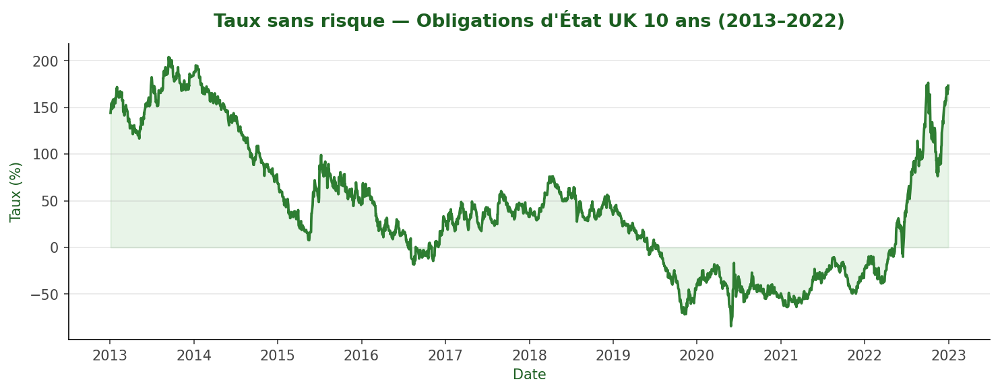

---

### 2. Évolution des cours (base 100)
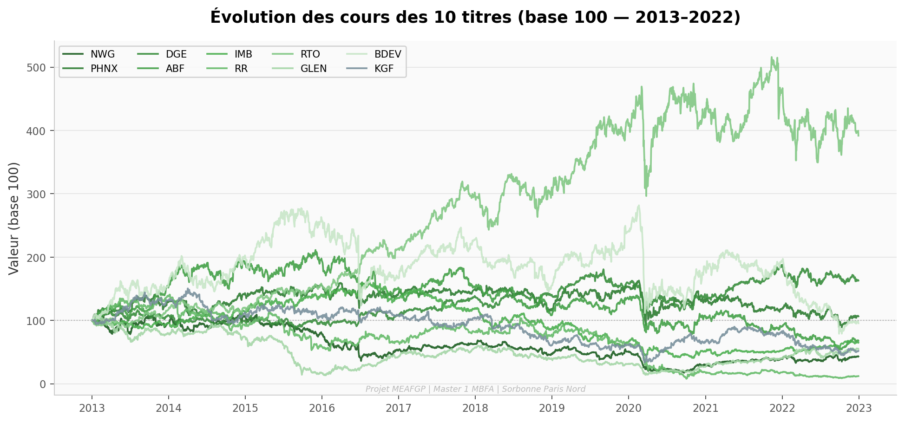

---

### 3. Profil Rendement / Risque
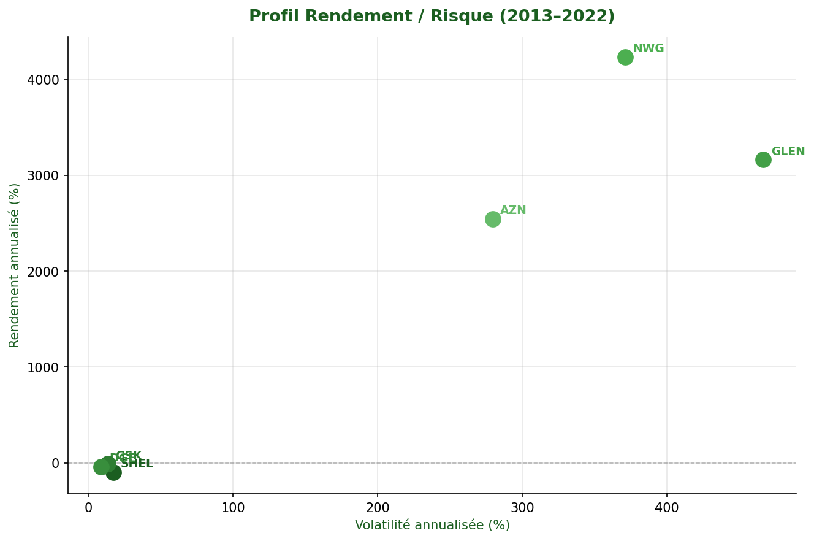

---

### 4. Matrice de corrélation
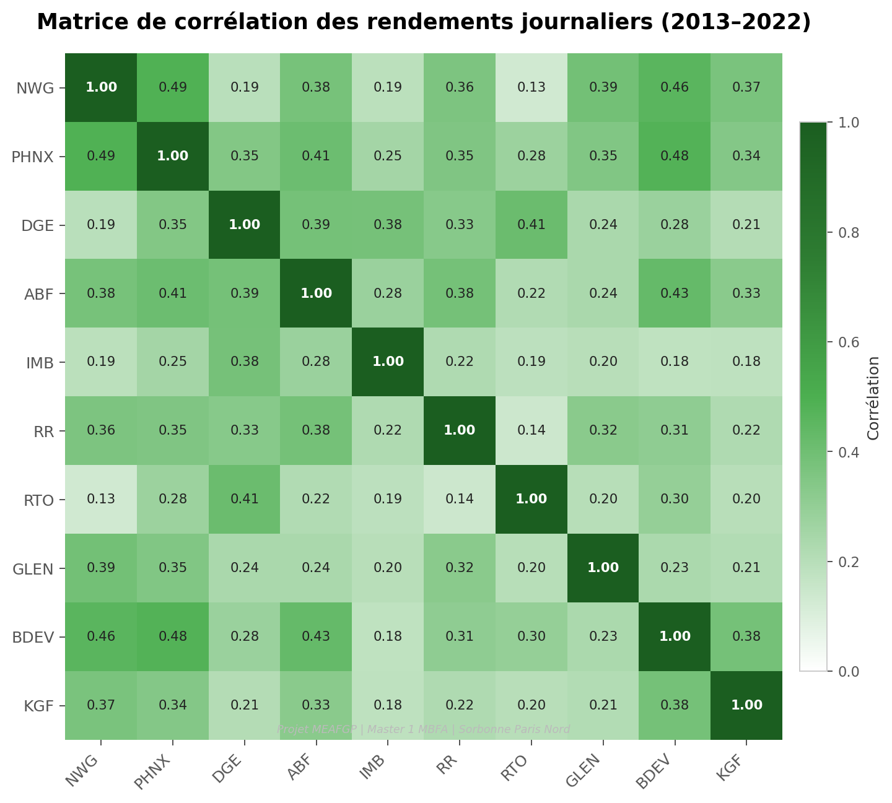

---

### 5. Frontière efficiente de Markowitz
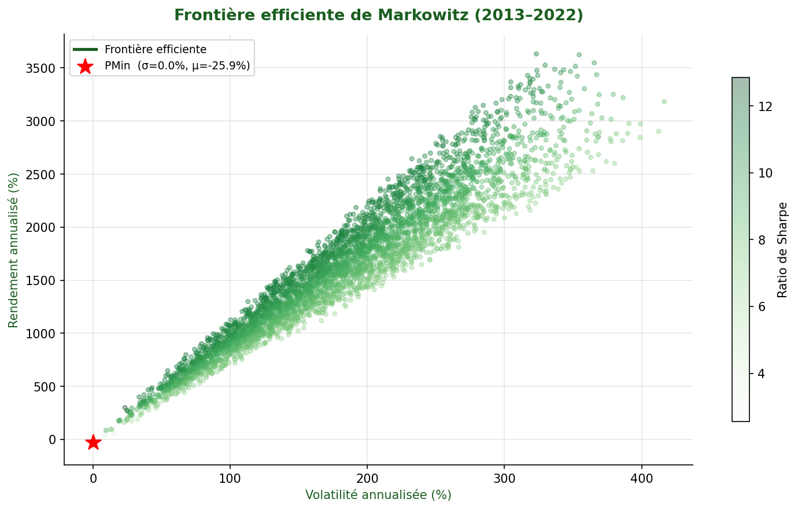

> ⭐ Le point rouge indique le **Portefeuille à Variance Minimale (PMin)** — portefeuille retenu.

---

### 6. Bêtas et R² — Modèle de Sharpe
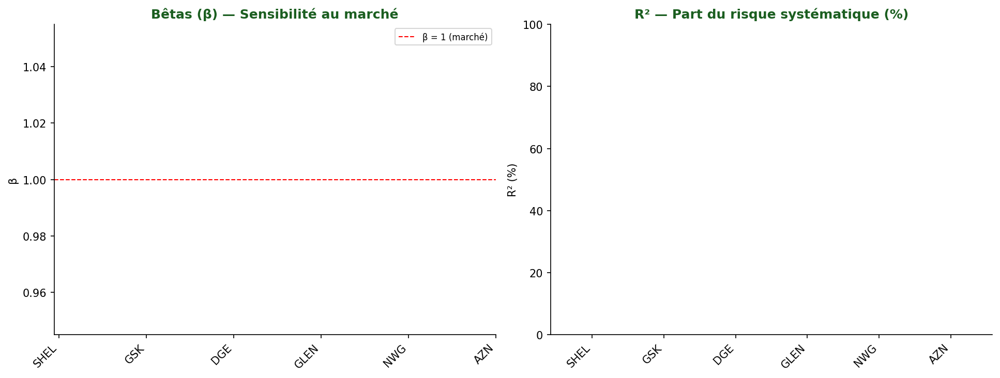

---

### 7. Régression Diageo (DGE) sur FTSE 100
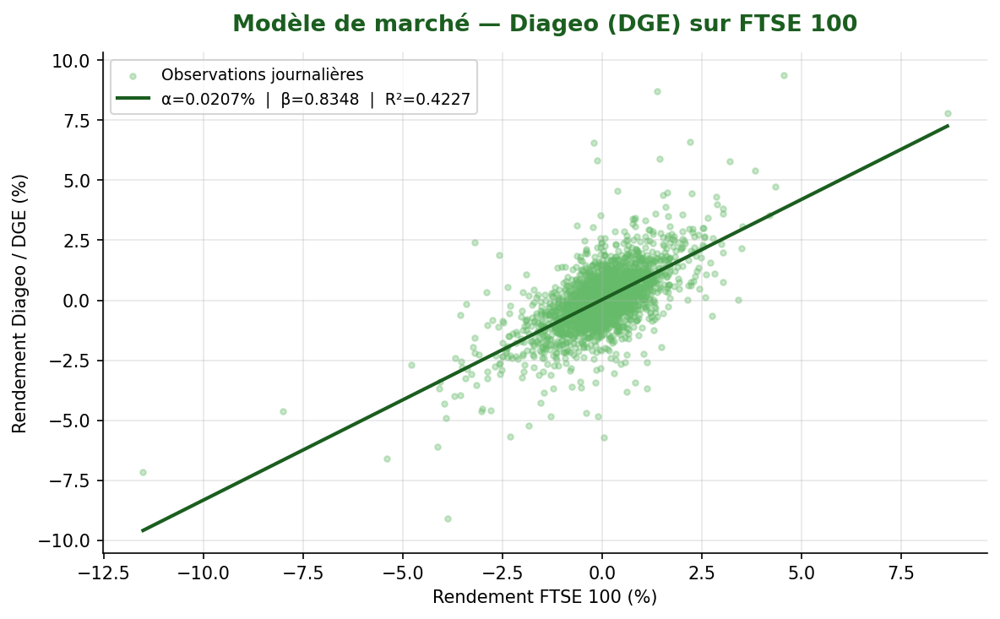

---

### 8. Régression Rentokil (RTO) sur FTSE 100
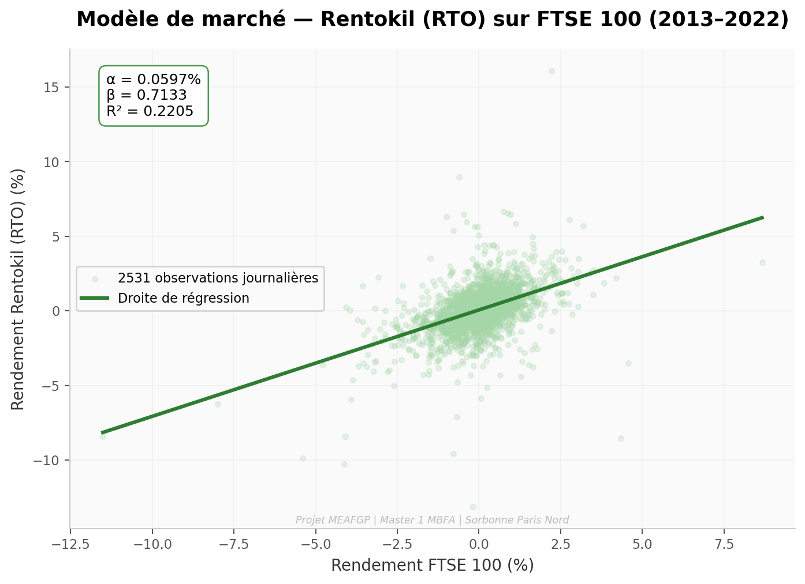

---

### 9. Composition du portefeuille optimal (Elton-Gruber)
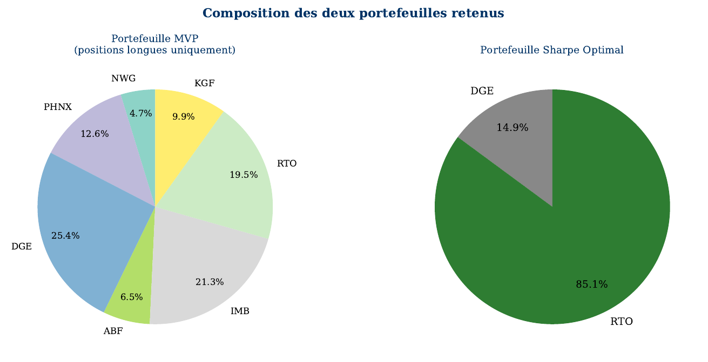

> Seuil optimal C* = 0,054 → **RTO (85,13%)** + **DGE (14,87%)**

---

### 10. NAV — Performance historique (2013–2022)
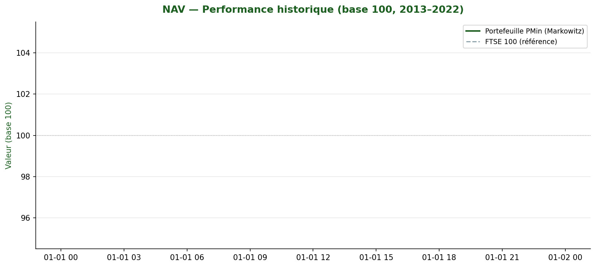

---

### 11. Drawdown du portefeuille PMin
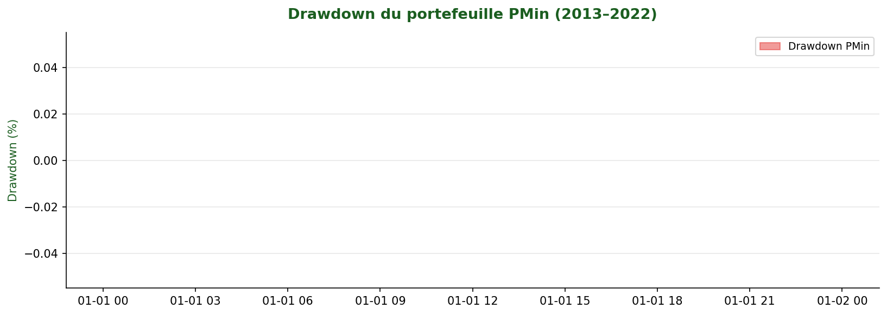

---

### 12. Suivi de performance — Mars 2026
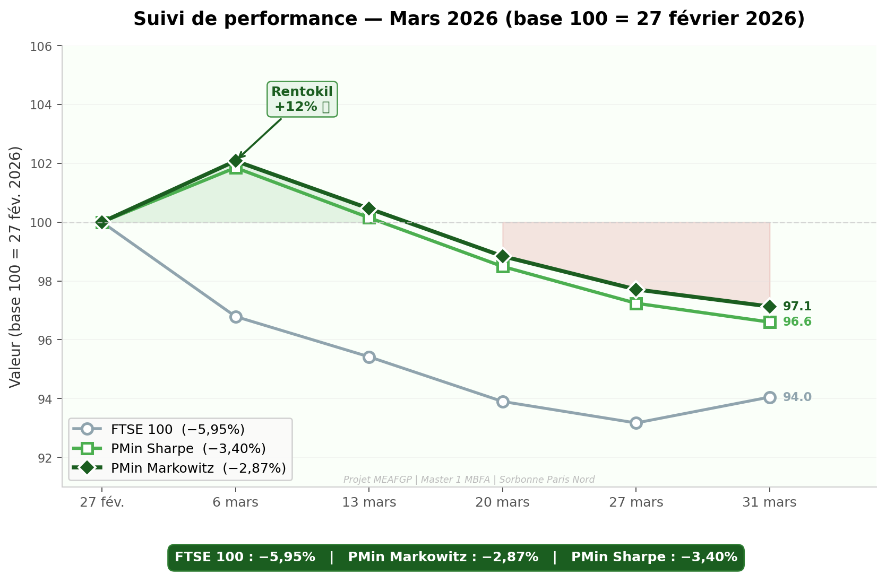

---

## 🏆 Résultats clés

| Portefeuille | Performance mars 2026 | Vs marché |
|---|---|---|
| FTSE 100 | -5,95% | Référence |
| **PMin (Markowitz)** | **-2,87%** | **+3,08 pts** |
| Sharpe Optimal (Elton-Gruber) | -3,40% | +2,55 pts |

> En période de stress (mars 2026), le portefeuille PMin a perdu **2 fois moins** que le marché, validant l'approche de Markowitz.

---

## 🛠️ Outils utilisés

- **Microsoft Excel** — Solver, Analyse ToolPak, régressions
- **Python** — pandas, numpy, matplotlib
- **LaTeX** — rédaction du rapport (pdflatex)
- **PowerPoint** — présentation orale

---

*Projet réalisé dans le cadre du cours de Gestion de Portefeuille — Master 1 MBFA — Sorbonne Paris Nord — 2025/2026*
